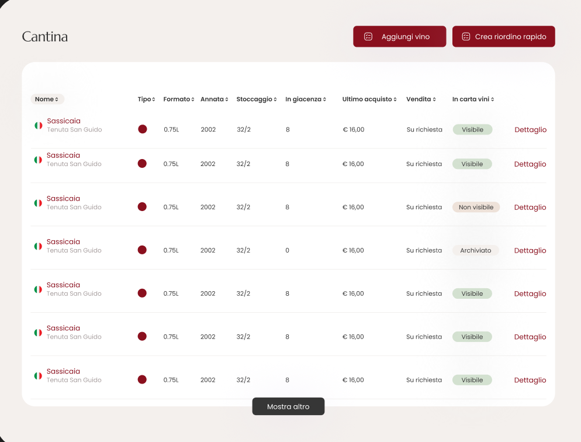

# 🍷 Frontend Test Project – Wine Management Table

## 📌 Overview

This is a frontend test project to evaluate your ability to build a **responsive wine management table component** using **Nuxt 3 (Vue 3 + Tailwind CSS)**.
We're looking for **clean, maintainable code**, **responsive design**, and **UX thinking**.

---

## 🛠️ Task

Using the provided mockup (`design.png`), build a responsive table component for a **Cantina (Wine Cellar)** management system.



### ✅ Requirements

* **Design Fidelity:** Match the desktop design as closely as possible.
* **Responsiveness:** Make it fully responsive for **tablet** and **mobile**.
* **Status Badges:** Display "Visibile", "Non visibile", and "Archiviato" with different colors.
* **Action Buttons:** Include "Aggiungi vino" and "Crea riordino rapido" buttons (should only print a `console.log` when clicked).
* **Load More:** Include "Mostra altro" button to load more data, if there is more.
* **UX Improvement:** Suggest at least **one improvement** for better usability on mobile.

---

## 📦 Deliverables

* A single `.vue` file or a small Nuxt project.
* Clear **comments** describing your approach and responsive choices.
* Proper **commit messages** showing your workflow.

---

## ⏱️ Time Limit (Important)

You have **30 minutes** to complete this task.

* Please **respect the 30-minute limit**.
* Commit and submit **whatever you have completed** within this time.
* We value seeing **how you think and work under time constraints**, not a fully finished product.

---

## 🚀 Project Setup

### Prerequisites

* Node.js 18+
* npm, yarn, or pnpm

### Installation

```bash
yarn install
```

### Run the project

```bash
yarn dev
```

Then open [http://localhost:3000](http://localhost:3000) in your browser.

---

## 📂 Project Structure

```
wcms-test-frontend/
├── app.vue
├── components/
│   └── CellarTable.vue        # Your component
├── composables/
│   └── useWines.ts            # Provided wine data
├── types/
│   └── schema.ts              # TypeScript types
├── nuxt.config.ts
├── package.json
└── README.md
```

---

## 🔑 Data Mapping

Use the `useWines` composable and map the data to the table columns:

* `wine.data.name` + `wine.data.winery` → **Nome**
* `wine.data.type` → **Tipo** (colored dot)
* `formatBottleSize(wine.size)` → **Formato**
* `wine.vintage` → **Annata**
* `wine.currentStock + "/" + wine.minRequiredStock` → **Stoccaggio**
* `wine.currentStock` → **In giacenza**
* `wine.fallbackPurchasePrice` → **Ultimo acquisto**
* `wine.price` → **Vendita** (static)
* `wine.visible` → **In carta vini** (badge)

---

## 📝 Evaluation Criteria

1. **Code Quality:** Clean, maintainable Vue 3 Composition API code.
2. **Responsiveness:** Properly adapted for tablet and mobile.
3. **UX:** Intuitive and user-friendly experience on all devices.
4. **Documentation:** Clear comments and explanation of decisions.
5. **Workflow:** Logical commits and project structure.

---

## 📤 Submission

1. Complete as much as possible **within 30 minutes**.
2. Add comments for:

   * UX improvements
   * Responsiveness approach
3. Commit your work and submit the repository or zipped folder.

---

## 🔎 Notes

* Tailwind CSS is preconfigured.
* Use semantic HTML and ensure accessibility.
* Focus on clarity and usability, not pixel-perfect visuals.